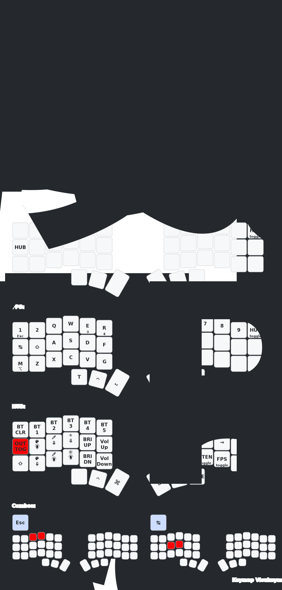

# Corne Keyboard Custom Keymaps (ZMK)

Custom keymaps for a Corne 42-key split keyboard running ZMK firmware.

# Table of Contents

- [Hardware Info](#hardware-info)
- [Current Keymap](#current-keymap)
- [Related Resources](#related-resources)
- [Pre-requisites](#pre-requisites)
- [Clone Repository](#clone-repository)
- [Editing the Keymap](#editing-the-keymap)
- [Building Firmware](#building-firmware)
- [Flashing the Keyboard](#flashing-the-keyboard)
    - [1. Download the firmware](#1-download-the-firmware)
    - [2. Connect the keyboard half via USB](#2-connect-the-keyboard-half-via-usb)
    - [3. Enter bootloader mode](#3-enter-bootloader-mode)
    - [4. Flash the firmware](#4-flash-the-firmware)
    - [5. Repeat for the other half](#5-repeat-for-the-other-half)
    - [6. Re-pair Bluetooth](#6-re-pair-bluetooth)
- [Settings Reset](#settings-reset)
  - [When to reset](#when-to-reset)
  - [How to reset](#how-to-reset)
- [Issues](#issues)
    - [Bluetooth pairing issues](#bluetooth-pairing-issues)
    - [Layers not switching correctly](#layers-not-switching-correctly)
    - [Keyboard name not changing after flash](#keyboard-name-not-changing-after-flash)
- [RGB Underglow](#rgb-underglow)
- [Enabling ZMK Studio](#enabling-zmk-studio)

# Hardware Info

| Property | Value |
|----------|-------|
| Keyboard | Corne (crkbd) 6-column split |
| Keys | 42 (3x6 + 3 thumbs per side) |
| MCU | nRF52840 (nice!nano v2 compatible) |
| Firmware | ZMK |
| Connection | Bluetooth Low Energy (BLE) |
| Device Name | `Afiq Zudin Corne42` |
| Display | SSD1306 OLED 128x32 (nice_oled module) |
| LEDs | WS2812 underglow (6/half) + per-key (21/half) — 54 total |
| BT Profiles | 5 (BT0-BT4) |
| ZMK Studio | Disabled (see [Enabling ZMK Studio](#enabling-zmk-studio)) |
| Vendor | KeebMaker |
| Vendor Config | [KeebMaker/zmk-config](https://github.com/KeebMaker/zmk-config) |

# Current Keymap



See [keymap-drawer/](keymap-drawer/) for text reference and keymap-drawer source files.

# Related Resources

- [ZMK Firmware Documentation](https://zmk.dev/docs)
- [ZMK Keycodes Reference](https://zmk.dev/docs/codes)
- [ZMK Studio](https://zmk.studio/) - Live keymap editor (no flashing needed)
- [Keymap Editor](https://nickcoutsos.github.io/keymap-editor/) - Visual keymap editor for GitHub repos
- [Vendor Config (KeebMaker)](https://github.com/KeebMaker/zmk-config)

# Pre-requisites

- Corne Keyboard (KeebMaker variant)
- macOS
- USB-C cable
- GitHub account (for building firmware via Actions)
- This Repository - [Custom Corne Keymaps](https://github.com/afiqzudinhadi/zmk-config)

# Clone Repository

```bash
git clone git@github.com:afiqzudinhadi/zmk-config.git
```

# Editing the Keymap

### Edit Config Files

For full customization (combos, steno layer, behaviors):

```
config/
├── corne.keymap          <- Edit this for keymap changes
├── corne.conf            <- Edit this for feature toggles (RGB, display, BLE)
└── west.yml              <- ZMK module dependencies (usually no changes needed)
```

Keymap guide can be found [here](https://zmk.dev/docs/codes).

# Building Firmware

1. Push changes to GitHub
2. Go to **Actions** tab → latest workflow run
3. Wait for the build to complete (green checkmark)
4. Download the `firmware` artifact (zip file)
5. Extract — contains `.uf2` files for left and right halves

If Actions is disabled on your fork: go to **Actions** tab → click "I understand my workflows, go ahead and enable them".

# Flashing the Keyboard

### 1. Download the firmware

Download the `firmware.zip` from the GitHub Actions artifacts and extract it.

The zip contains:
- `nice_corne_left_oled_rgb-nice_nano_v2-zmk.uf2` — left half
- `nice_corne_right_oled_rgb-nice_nano_v2-zmk.uf2` — right half
- `nice_settings_reset-nice_nano_v2-zmk.uf2` — settings reset (see [Settings Reset](#settings-reset))

### 2. Connect the keyboard half via USB

Plug in the **left** half of the keyboard with a USB-C cable.

### 3. Enter bootloader mode

Double-tap the reset button on the keyboard. The keyboard will appear as a USB drive (e.g. `NICENANO`).

- The reset button is on the PCB (check underneath the keyboard or through the case hole).
- The LEDs on the keyboard will turn off.
- If the drive doesn't appear, try double-tapping faster or slower.

### 4. Flash the firmware

Drag the **left** `.uf2` file onto the USB drive. The keyboard will automatically reboot and the drive will disappear.

### 5. Repeat for the other half

1. Plug in the **right** half via USB-C
2. Double-tap the reset button
3. Drag the **right** `.uf2` file onto the USB drive

### 6. Re-pair Bluetooth

If you changed the keyboard name or did a settings reset:

1. Open **System Settings → Bluetooth** on macOS
2. Remove the old keyboard entry (e.g. `Corne_Oled_RGB`)
3. Put the keyboard in pairing mode (it should be discoverable automatically)
4. Pair with `Afiq Zudin Corne42`

# Settings Reset

### When to reset

Do a settings reset when:
- **Layer structure changed** (layers added, removed, or reordered) — ZMK Studio saved state stores the old layer layout and will override the new compiled keymap
- Layers are not switching correctly after flashing new firmware
- Keyboard name didn't change after flash
- Both halves won't pair with each other
- ZMK Studio saved changes are interfering with your compiled keymap
- Bluetooth pairing issues after firmware update

### How to reset

1. Download `nice_settings_reset-nice_nano_v2-zmk.uf2` from the firmware artifacts
2. Connect the **left** half via USB
3. Double-tap the reset button to enter bootloader mode
4. Drag `nice_settings_reset-nice_nano_v2-zmk.uf2` onto the USB drive
5. **Immediately** double-tap reset again to put it back in bootloader mode (to avoid accidental bonding)
6. Repeat steps 2-5 for the **right** half
7. Now flash the actual firmware to both halves (left `.uf2` to left, right `.uf2` to right)
8. After flashing both halves, reset both at the same time to pair them together
9. Remove old Bluetooth entry from macOS and re-pair

# Issues

### Bluetooth pairing issues

If the keyboard won't pair after flashing:

1. Clear the BT profile: go to HUB layer → press `BT_CLR`
2. Remove the device from macOS Bluetooth settings
3. Re-pair

If issues persist, do a full [Settings Reset](#settings-reset).

### Layers not switching correctly

If `->STEN`, `->FPS`, or other layer switches go to CARP instead of the expected layer, ZMK Studio's saved state is overriding your compiled keymap. Do a [Settings Reset](#settings-reset) to clear it.

### Keyboard name not changing after flash

The BLE name is cached in device settings. Do a [Settings Reset](#settings-reset) and re-pair.

# RGB Underglow

### Hardware

54 WS2812 LEDs total — 6 underglow + 21 per-key per half. Chain length set in `config/nice_nano_v2.overlay`.

### Config

RGB settings are in `config/corne.conf`:

| Setting | Value | Description |
|---------|-------|-------------|
| `CONFIG_ZMK_RGB_UNDERGLOW` | `y` | Enable RGB |
| `CONFIG_ZMK_RGB_UNDERGLOW_ON_START` | `n` | Off on boot |
| `CONFIG_WS2812_STRIP` | `y` | WS2812 LED driver |
| `CONFIG_ZMK_RGB_UNDERGLOW_EFF_START` | `3` | Default effect: 0=Solid, 1=Breathe, 2=Spectrum, 3=Swirl |
| `CONFIG_ZMK_RGB_UNDERGLOW_BRT_STEP` | `1` | Brightness step (%) |
| `CONFIG_ZMK_RGB_UNDERGLOW_AUTO_OFF_IDLE` | `y` | Turn off when idle |
| `CONFIG_ZMK_RGB_UNDERGLOW_EXT_POWER` | `n` | Don't toggle external power with RGB |

Optional tuning (commented out in config):
- `HUE_STEP` / `SAT_STEP` — hue and saturation adjustment step
- `HUE_START` / `SAT_START` / `BRT_START` — initial color values

### Effects

| `EFF_START` | Effect |
|-------------|--------|
| 0 | Solid color |
| 1 | Breathe |
| 2 | Spectrum |
| 3 | Swirl |

Cycle at runtime with `RGB_EFF` (next) / `RGB_EFR` (previous).

### Keycodes

| Keycode | Action |
|---------|--------|
| `RGB_TOG` | Toggle on/off |
| `RGB_EFF` | Next effect |
| `RGB_EFR` | Previous effect |
| `RGB_HUI` / `RGB_HUD` | Hue up/down |
| `RGB_SAI` / `RGB_SAD` | Saturation up/down |
| `RGB_BRI` / `RGB_BRD` | Brightness up/down |
| `RGB_SPI` / `RGB_SPD` | Speed up/down |
| `RGB_COLOR_HSB(h,s,b)` | Set specific color |

Docs: [zmk.dev/docs/keymaps/behaviors/underglow](https://zmk.dev/docs/keymaps/behaviors/underglow) · [zmk.dev/docs/config/underglow](https://zmk.dev/docs/config/underglow)

### Runtime Controls (HUB Layer)

| Key | Action |
|-----|--------|
| `[RGB]` | Tap-dance: 1×=toggle, 2×=effect fwd, 3×=effect rev |
| `[CLR]` | Tap-dance color presets: purple → white → red → blue → green |
| `HUE+` / `HUE-` | Adjust hue |
| `SAT+` / `SAT-` | Adjust saturation |
| `BRT+` / `BRT-` | Adjust brightness |

# Enabling ZMK Studio

ZMK Studio is disabled by default in this config. To enable live keymap editing:

1. In `config/corne.conf`, uncomment:
   ```
   CONFIG_ZMK_STUDIO=y
   CONFIG_ZMK_STUDIO_LOCKING=n
   ```

2. In `build.yaml`, add `studio-rpc-usb-uart` to the left half snippet:
   ```yaml
   snippet: rgb-config studio-rpc-usb-uart
   ```

3. Push and flash.

5. Go to [zmk.studio](https://zmk.studio/) in Chrome → connect via USB or BLE → edit layers visually.

**Limitations:** Cannot add combos, custom behaviors, or change display/RGB config.

**Warning:** ZMK Studio saves changes to flash storage. These override the compiled keymap. If layers behave unexpectedly after flashing, do a [Settings Reset](#settings-reset).

# Per-Key RGB Layer Indicators

Uses [darknao's per-key RGB patches](https://github.com/darknao/zmk) cherry-picked onto ZMK v0.3.0 at [afiqzudinhadi/zmk@rgb-layer](https://github.com/afiqzudinhadi/zmk/tree/rgb-layer).

Effect #4 (Layer Indicators) shows different per-key colors based on active keymap layer. Colors are defined as hex RGB values in `corne.keymap` under the `underglow-layer` node.

### LED Chain Order (Foostan Corne v1.1)

Column-by-column snake, not row-by-row:
```
Chain 0-5:   Underglow (6 LEDs)
Chain 6-9:   Thumb outer → bottom/home/top col0
Chain 10-12: Top/home/bottom col1
Chain 13-14: Thumb mid → Thumb inner
Chain 15-17: Bottom/home/top col2
Chain 18-20: Top/home/bottom col3
Chain 21-23: Bottom/home/top col4
Chain 24-26: Top/home/bottom col5
```

### Changing Layer Colors

Edit `underglow-layer` bindings in `config/corne.keymap`. Each layer has 42 entries (one per key position):

```dts
carp_rgb {
    layer-id = <0>;
    bindings = <&ug GREEN &ug BLUE ...>;  // 42 entries
};
```

Available colors (`dt-bindings/zmk/rgb_colors.h`): `GREEN` `RED` `BLUE` `TEAL` `ORANGE` `YELLOW` `GOLD` `PURPLE` `PINK` `WHITE` `___` (off)

Custom colors: `#define CYAN 0x00ffff` then `&ug CYAN`

### Notes

- **`chain-length = <27>`** must be set in `corne.keymap` — the fork's shield overlay defaults to 10.
- **Underglow LEDs** turn off on effect #4 (mapped to `255` in pixel-lookup). To give them layer colors, map to key positions instead of `255`.
- Brightness/hue/saturation controls don't affect layer indicator colors ([#1](https://github.com/afiqzudinhadi/zmk/issues/1), [#4](https://github.com/afiqzudinhadi/zmk/issues/4)).
- Custom RGB effects can be added in the [ZMK fork](https://github.com/afiqzudinhadi/zmk/tree/rgb-layer) (`app/src/rgb_underglow.c`).
